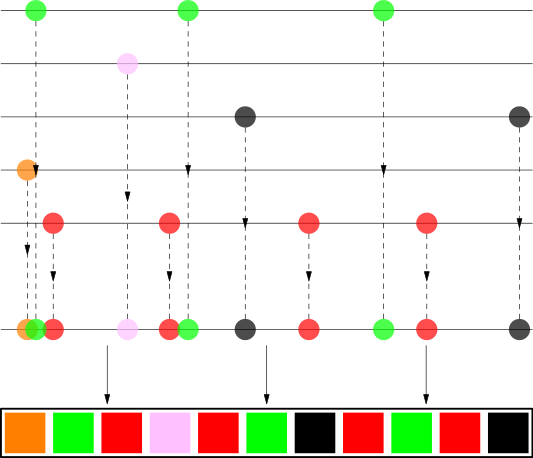

# Why Is Spotify Shuffle So Repetitive?
Whenever I log into spotify and press shuffle I always feel like I always end up listening to the same song, so I decided to investigate a little further. Turns out, there's nothing random about shuffling. There's great explenations on youtube, but I'll summarize it:

## 1. True Randomness (Old Algorithm)

Back in 2014, the shuffle feature was truly a mathematical randomness. Meaning that by shuffling a 2000 track playlist you could have the same song playing back to back or have the same song pop up every day. It's unlikely but not impossible, in fact some people experienced it and complained to Spotify, claiming that the shuffle wasn't random at all and that the authors of the songs that the shuffle kept re-playing were paying for Spotify to do so.

Imagine flipping a coin; You decide to go with heads and the coinflip turns out to be tail. For your next flip you'll probably decide to stay with heads because you think it's more likely to get a tails and a head rather than two tails.

In reality, you could have a streak of infite tails without your chances of getting heads going any further than 50%. The consumer tends to think that 'random' means that you're guaranteed different results each time. But this isn't true at all. The chance of getting heads or tails will always be 50% in every individual coin flip no matter how many times you flip the coin.

So technically, out of a very large playlist you **could** be hearing the same song every day in an actual random algorithm, giving you the thought of "this can't be random if I'm getting tails every time".

In response to the negative feedback, The main developer of the shuffle explained that the alogrithm was nothing but purely mathematical chance. The public wasn't convinced so, Spotify abandoned the truly random shuffle and created a new algorithm that would create the 'illusion of randomness' instead of actual randomness.

## 2. The User Percieved Randomness (Current Algorithm)

This new algorith pre-scans your playlist and intentionally spaces out songs from the same artist/album/genre. This new shuffle assures that if the first song that pops up is *NISSAN ALTIMA* by Doechii, the next song will never be *BOILED PEANUTS*. In fact, the next one to pop up probably won't even be a rap song.

This gives the illusion of randomness to the user, but it's actually not random at all. It's a curated list with intentional space outs all over it.

The algorithm sorts the playlist into lists of songs by the same artist. Then it assigns a positional weight to each track so that tracks form the same artist are evenly spaced but with some randomness in it. Here's a very interesting implementation I found on code golf: (https://codegolf.stackexchange.com/questions/198094/spotify-shuffle-music-playlist-shuffle-algorithm)

At this point you must be wondering, If this algorithm is so curated to not collapse songs of the same artist, why am I always served *No Surprises* by Radiohead?

## 3. The Contrasting Engagement Prioratizing Algorithm

The Spotify shuffling doesn't just make sure that you don't listen to the same artist back to back on a single shuffle. It also does what every social media algorithm does; Accomodate things to your liking so that they can keep you engaged.

They don't want you to click off and loose that sweet ad-revenue or monthly subscription money. God forbid the algorithm serves you a song you dislike and make you close the app. So what they do is simple, **they decide what you like for you**. Looked up a song once? That is now you're favorite track. Each song you don't skip is a song they're gonna serve to you again expecting the same results. The algorithm tracks your activity and replicates it again for you hoping that you'll love it as much as the first time.

So the algorithm is constantly fighting itself trying to give you variety and routine all at the same time. And, since it's more profitable for them, Spotify chooses to give you more of what you like instead of showing you new things. Spotify is afraid that you'll leave if they serve you a song that you've put in your playlist yourself but you haven't listened to in a while.

## 4. Why I Dislike It

I want to clarify that this a purely personal take, I understand that a lot of people feel comfortable playing the same 50 songs that they know they like in a constant loop. But that's not me. I'm not a music snob or anything, but i do like variety and love to discover new artists, which feels impossible to do inside the app.

I watched this video on how to discover new music and saw a comment that read: "Being a music fan also means listening to a ton of music you don't like at all and I feel like listening to stuff you don't like is geniunely important for knowing what you do like" And I couldn't agree more.

In a perfect world, music streaming platforms would still track what you like, but help you find more of that music instead of just shoving it back to you again every single day. So that's exactly what I'm gonna ***attempt*** to create

## Sources
- https://codegolf.stackexchange.com/questions/198094/spotify-shuffle-music-playlist-shuffle-algorithm
- https://www.youtube.com/watch?v=MOqo1vS3lD4&t=211s (check out this creators web app for a true random shuffle on the playlists)
- https://www.youtube.com/watch?v=OdLyKETk5o0
- https://engineering.atspotify.com/2014/02/how-to-shuffle-songs (the article they released about the 2014 fix is no longer available but was used in the implementation of codegolf)